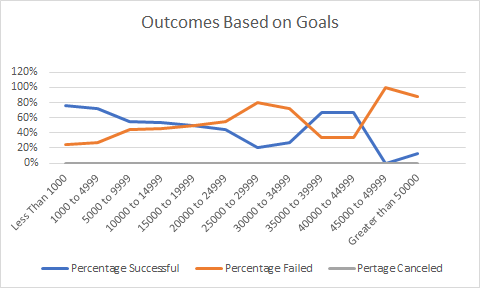

# Kickstarter-analysis
Understanding trends on Kickstarter Analysis data set
## Overview of Project
Louis has asked us to help understand her play Fever outcomes.  She wants us to analyze how other campaigns have compared in relations to their launch date and fundraising goals to glean more useful information. She has given us a data set that gives us more information about each campaign.
### Purpose
The purpose of this analysis is to create visualization that can help Louis understand various campaign trend. We have analyzed outcomes based on launch date and fundraising goals.
## Analysis and Challenges
### Analysis of Outcomes Based on Launch Date
We conducted analysis on our Kickstarter-Analysis dataset and created a pivot table to display a line graph. We analyzed theater outcomes based on launch date. We created a pivot table from our data set and created filter for categories, theater, and year. We made our columns each of the outcomes – successful, failed, and canceled – and our rows each month each campaign was launched. For our values we found the total counts of each outcome for each month. From out pivot table we were able to generate a line graph that gave us our results. 
### Analysis of Outcomes Based on Goals
In analyzing each campaign outcome based on goals, we created a line chart to visualize the trend. First, we filtered through our data to differentiate different goal groups, each ranging between $5000. Using CountIf() function, we found the total number of successful, failed, and canceled campaigns for each goal group. We pulled this data from the original Kickstarter data set. Next, we found the sum of project for each goal group using Sum() function. Then, we found the percentage of each campaign type for each goal group. When we created our line graph, we found these results. 
### Challenges and Difficulties Encountered
Some challenges we can possibly face when creating this visualization is making errors in such a loaded worksheet. Each cell has its own formula and small errors can be easy to miss. If we make a mistake in any of the formulas or data would be misinformed. 
## Results
- What are two conclusions you can draw about the Outcomes based on Launch Date?
Based on our line graphs we can conclude that we can expect a more successful campaign if it is started in the spring. We see a steady increase in the months between March and May. While successful campaigns are prevalent through the year, we notice a small decline in the summer months, June, all the way through the end of the year. We can also conclude that fall months between September and November do not have the best results for campaign launches. While failed campaign remain steady through the year, we see a small peak in failed campaigns with no canceled campaigns in October.
- What can you conclude about the Outcomes based on Goals?
The outcomes based on goals show us that those campaigns that set lower goals were more likely to reach their goal. This is predictable since it is easier to reach smaller number. We also see a similar trend in that failed campaigns had higher campaign goals. These goals were likely out of their realm of possibilities and led to their failure. 
- What are some limitations of this dataset?
Some limitations of this dataset are that only a small number of campaigns are represented. We only have so much of a sample size for theater. In addition, neither of our information can tell us the cause of these outcomes. We don’t have background information such as where these campaigns specifically took place. Were these campaigns kicked off nationally, statewide or locally? What is going on in the world politically, such as wars, depressions, and pandemics? While we have years included, the dataset alone is limited about these extraneous factors.
- What are some other possible tables and/or graphs that we could create?
We could also create a table that shows trends based on country. We could create a pivot table that shows us similar outcomes to our launch date or fundraising goals, but with the ability to show by country so we can understand where she might have a better chance of leading a campaign. We could also single out and filter for successful campaigns and understand those trends specifically. For example, could create a bar graph showing how successful campaigns performed by country. We could also analyze our outcome based on length of campaign and how that would affect fundraising goals.
